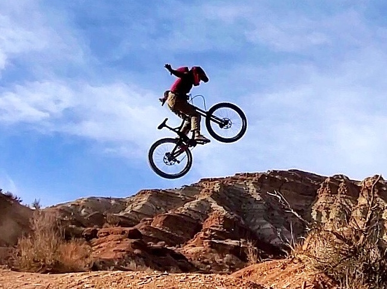
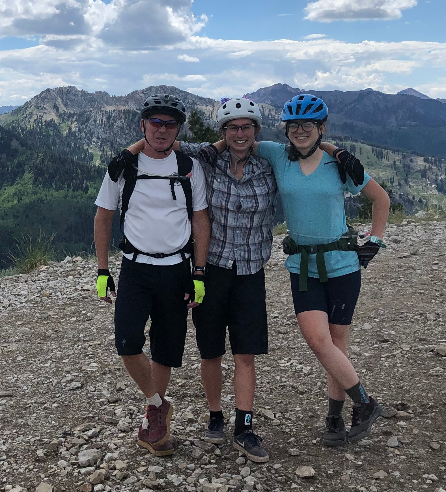
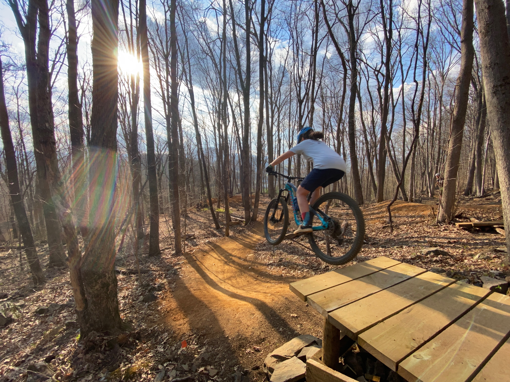

<figure>

</figure>

<figure>

</figure>

<figure>

</figure>

<figure>

</figure>

- [Masters Swimming](http://www.usms.org/)
- [Fitness Log (USMS)](http://www.usms.org/myusms/flog/)
- [USA Swimming](http://www.usaswimming.org/DesktopDefault.aspx)
- [North Carolina Masters (Swimming)](http://www.ncmasters.org/)
- [ASU Recreation Center](http://urec.appstate.edu/student-recreation-center)
- [County Pool](http://www.wataugacounty.org/App_Pages/Dept/ParksRec/Aquatics/aquaticsHome.aspx)
- [National Interscholastic Cycling Association (NICA)](https://www.nationalmtb.org/)
- [North Carolina NICA](http://www.northcarolinamtb.org/)
- [Ray's Weather Center](http://booneweather.com/)

* * *